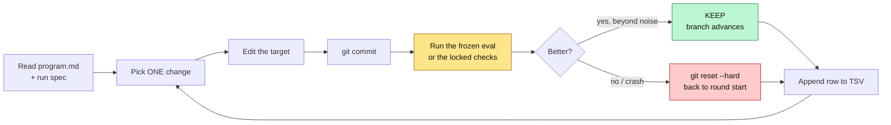
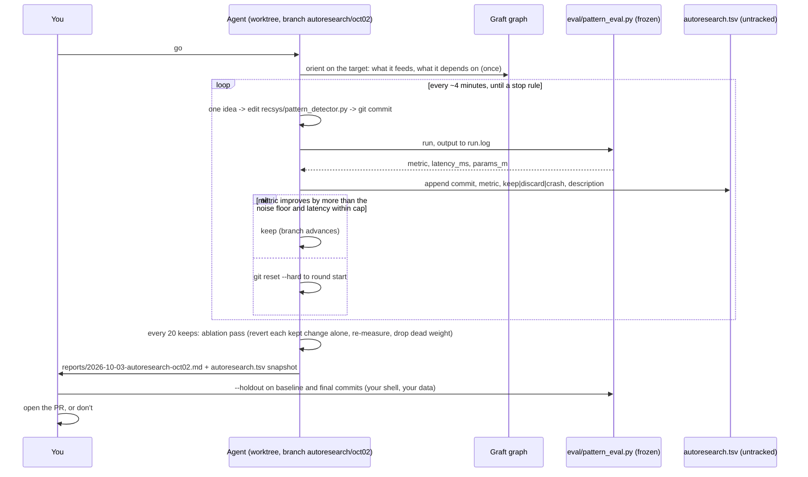
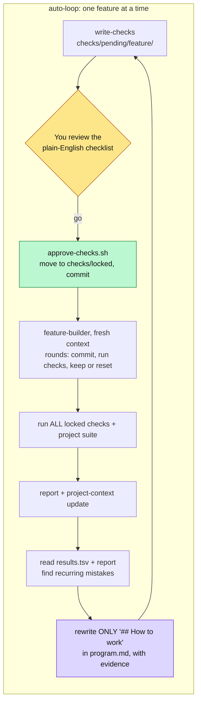

<div align="center">

# k-auto-loop

**Karpathy-style autonomous loops for Claude Code, on your own repos.**
Checks before code. A scorer the agent cannot touch. One commit per round. Keep on improvement, reset on anything else.
Plus the one change that makes the loop improve itself, and a code graph so it never has to read the whole repo.

[](LICENSE)
[](https://code.claude.com)
[](https://github.com/trailhq/Graft)
[](https://github.com/karpathy/autoresearch)

</div>

---

## Contents

- [What it is](#what-it-is)
- [How a loop works](#how-a-loop-works)
- [Quick start](#quick-start)
- [What is in the box](#what-is-in-the-box)
- [Example: onboarding a repo with `/kloop-setup`](#example-onboarding-a-repo-with-kloop-setup)
- [Example: starting a run with `/kloop-project`](#example-starting-a-run-with-kloop-project)
- [Walkthrough: what happens overnight, and what it touches](#walkthrough-what-happens-overnight-and-what-it-touches)
- [The build loop and the auto-loop](#the-build-loop-and-the-auto-loop)
- [Safety model](#safety-model)
- [When not to use a loop](#when-not-to-use-a-loop)
- [Knobs](#knobs)
- [Credits](#credits)

---

## What it is

Andrej Karpathy's [autoresearch](https://github.com/karpathy/autoresearch) gives an AI agent one editable file, one frozen scorer, and a plain-English `program.md`, then lets it run experiments all night: change, train five minutes, score, keep or `git reset`, repeat. He ran it for two days, 700 experiments, about 20 kept. Tobi Lütke pointed the same pattern at Shopify's templating engine and got 53% faster rendering from 93 automated commits. The pattern is not about ML. It is about anything with a number you can measure.

This package turns that pattern into something you can install on a repo you actually ship from, in three parts:

| Part | What it does | Where the idea comes from |
|---|---|---|
| **`autoresearch`** | One editable target, one frozen eval that prints `metric: <n>`, a dedicated branch, an endless commit / eval / keep-or-reset loop with a TSV lab notebook | Karpathy's `program.md`, generalised |
| **`build` + `auto-loop`** | Features scored by checks written *before* the code and locked so the agent cannot soften them. A fresh builder per feature. An outer loop that reads the results log and rewrites how the inner loop works | AI LABS, [He Finally 10x Claude Code With This Method](https://www.youtube.com/watch?v=qLfSDQ5NGh0) |
| **Graft + the interview skills** | A local code graph, wired in by `graft init` and used as Graft intends, so each round asks "what uses this" instead of grepping, and two conversational skills that onboard a repo and start a run while showing you everything before it lands | Trail HQ's [Graft](https://github.com/trailhq/Graft), AI LABS' [Graft video](https://www.youtube.com/watch?v=cyIWQHYoUg8) |

Everything is plain Markdown, shell, and one small Python hook under `.claude/`. No daemon, no service, no API key beyond your Claude Code subscription.

---

## How a loop works

Every mode shares the same round mechanics. The agent never grades its own work: the score comes from something it cannot edit.



The TSV is deliberately **untracked by git**, so a reset never erases the record of what was tried. Discards and crashes are logged with the same care as keeps; they are what the outer loop learns from.

Three things only a human does: pick the metric, approve the checks, and decide what ships.

---

## Quick start

```bash
git clone https://github.com/jonberliner/k-auto-loop
cd k-auto-loop
./install.sh ~/repos/your-project --graft     # copies skills, agent, scripts, templates; runs graft init + build
cd ~/repos/your-project && claude
```

Then, inside Claude Code:

```
/kloop-setup                                   # once per repo: Graft first, recon, short interview, review, write
/kloop-project optimise the pattern detector   # once per run: scope, metric, budgets, review, baseline, go
```

Both skills stop and show you everything they drafted before a single file is written. The manual route is still there: `/project-context`, edit `program.md`, then `/build <feature>`, `/auto-loop <features>`, or `/autoresearch`.

> [!NOTE]
> This repo is itself an installed instance. Open it in Claude Code and point `/autoresearch` at `examples/autoresearch-python-speed/` to watch a loop run in minutes.

---

## What is in the box

```
.claude/
  skills/
    kloop-setup/        onboard a repo: Graft first, graph recon, 2-3 question batches, review gate, write, verify
    kloop-project/      start a run: graph-drafted scope, metric candidates, budgets, review gate, baseline, go
    project-context/    memory bank for what the graph cannot map: intent, conventions, process, non-code files
    write-checks/       checks BEFORE code, into checks/pending/<feature>/, plus a plain-English checklist
    build/              driver: checks -> your approval -> lock -> fresh builder -> verify -> report
    auto-loop/          one feature at a time; rewrites "## How to work" in program.md from evidence
    autoresearch/       Karpathy's metric loop for any target + eval, with noise floor and ablation passes
  agents/
    feature-builder.md  fresh-context builder that runs the rounds; uses Graft as wired; logs excursions
  kloop/
    approve-checks.sh   checks/pending/<f> -> checks/locked/<f>, then commit (the human gate)
    run-checks.sh       run locked checks; prints checks_total / checks_passed / failing / status
    log-result.sh       append one round to results.tsv
    guard-locked.py     PreToolUse hook: blocks edit / rm / mv / sed -i / redirects into protected paths
    protected.txt       extra protected prefixes (your frozen eval, data manifests, prod code)
    config.sh           CHECK_CMD / SUITE_CMD overrides
    repo.md             repo profile written by /kloop-setup
    runs/<tag>.md       one run spec per loop run, written by /kloop-project
  settings.json         deny rules for checks/locked + the guard hook
templates/
  program.md            build-loop rules: "## Fixed rules" (yours) + "## How to work" (auto-loop's)
  autoresearch.program.md
  features.md           feature tracker with rules as observable behaviour
  repo.md / run.md      profile and run-spec templates the interview skills fill
  eval_template.py      frozen-eval scaffold: pinned data, time box, asserts, metric line
examples/
  autoresearch-python-speed/   toy target + frozen eval; runs in minutes
  recsys-pattern-detector/     layout for a production recommender
  feature-loop-walkthrough/    one feature through the build loop
notes/
  video-summary.md      the first AI LABS video, paraphrased section by section
  karpathy-autoresearch.md     design, loop, results, lessons from people who ran it
  graft.md              why Graft is here, what the second video adds, CLI quick reference
  sources.md            every link used
install.sh              copy into another repo, merge settings, optionally graft init + build
```

---

## Example: onboarding a repo with `/kloop-setup`

A large product-recommendation repo. Names are illustrative; the shape is what the skill produces.

<details open>
<summary><b>0. Graft first</b></summary>

```
you    › /kloop-setup

claude › Graft is not installed. It builds a local code graph the loops navigate
         with instead of grepping. Options: install globally (npm install -g
         @nanonets/graft), use npx per call, or skip it.

you    › install globally

claude › Installed 0.21.1. Dry run of `graft init --agents claude` would write:
           .claude/skills/graft/SKILL.md   .mcp.json
           .claude/helpers/graft-hooks.cjs  hooks + statusLine merged into .claude/settings.json
           graft/ (git-ignored)
         Running init and build...
         graph: 4,812 nodes, 11,203 edges, Python + TypeScript. `graft check` OK.
         k-auto-loop deny rules and guard hook still present after Graft's merge.
```
</details>

<details open>
<summary><b>1. What I found</b> (ten lines, no questions yet)</summary>

```
claude › What I found
         1. Python 3.11 monorepo, uv; a Next.js admin under web/.
         2. Tests: `uv run pytest -q` (CI runs it in ~6 min); web uses vitest.
         3. Graph hubs: recsys/scoring.py, recsys/features.py, api/routes.py.
         4. Likely lab: recsys/ (pattern_detector.py, ranker.py are hotspots, 41 commits in 6 months).
         5. Likely protected: eval/, data/manifests/, recsys/features.py (feeds prod), infra/, migrations/.
         6. Existing metric code: eval/offline_metrics.py computes NDCG@10 and precision@k.
         7. Compute: 1x A10 GPU, 32 CPU. Fits a 3-minute time box for a sklearn/torch detector.
         8. Holdout candidate: data/manifests/holdout_2026q3.json points outside the repo. Good.
         9. .claude/ already has a statusline; Graft kept it.
        10. Surprise: recsys/pattern_detector.py imports from web/scripts/. That edge will be in scope talk.
```
</details>

<details open>
<summary><b>2. Interview</b> (structured questions, defaults pre-filled from recon)</summary>

```
claude › Batch A
         1. What will loops do here?        ● optimise metrics (Recommended)  ○ build features  ○ both
         2. Where may agents edit?          ● lab area: recsys/ (Recommended)  ○ anywhere on a branch  ○ one file only
         3. Protected (multi-select):       ☑ eval/  ☑ data/, manifests  ☑ recsys/features.py  ☑ infra/, migrations/
                                            ☑ existing test suite  ☐ web/
         4. Isolation:                      ● worktree per run, headless overnight (Recommended)  ○ branch here  ○ sandbox

you    › 1 both. 2 fine. 3 add web/ too. 4 worktree.

claude › Batch B
         5. Check runner: `uv run pytest {dir} -q -rf`; full suite `uv run pytest -q` (6 min) at feature end only?   ● yes
         6. Budgets: 3 min per eval, 8 rounds per feature, builder maxTurns 150, ~100 experiments a night.      ● yes
         7. Scope policy:                   ● soft (Recommended)  ○ hard
         8. Graft depth:                    ● structural only (Recommended)  ○ --deep (needs GRAFT_API_KEY)

you    › 6: 4 min per eval. rest fine.

claude › Batch C
         9. Delivery:  ● commits stay on the loop branch, you open the PR (Recommended)  ○ agent opens a draft PR
        10. Repo-specific nevers (free text)?
        11. Non-code context for project-context?
        12. Holdout path and secondary constraints?

you    › 9 recommended. 10 never call the live feature store; never touch anything under recsys/serving.
         11 PRD lives in docs/prd/, deploys go through infra/README. 12 holdout is ~/data/recsys-holdout-2026q3.parquet,
         print latency_ms and params_m, latency is a hard cap at 20ms.
```
</details>

<details open>
<summary><b>3. Review gate</b> (nothing written yet)</summary>

```
claude › Here is everything I will write. Approve, or tell me what to change.

         .claude/kloop/repo.md ............ full text below (38 lines)
         .claude/kloop/protected.txt ...... eval/ data/ recsys/features.py recsys/serving/ infra/ migrations/ web/
         .claude/kloop/config.sh .......... CHECK_CMD="uv run pytest {dir} -q -rf"  SUITE_CMD="uv run pytest -q"
         program.md ## Fixed rules ........ diff: round cap 8; done = checks + wired + suite green; delivery = branch only;
                                            nevers: live feature store, recsys/serving; lab = recsys/; scope policy soft
         .claude/skills/project-context ... filled: stack, run/test, routes, data model, conventions, PRD + deploy pointers,
                                            "Graft owns code structure; this holds the rest"
         .claude/agents/feature-builder ... maxTurns 150 (unchanged)
         .claude/settings.json ............ + Edit(eval/**), Edit(recsys/serving/**), Edit(web/**) deny rules

         ● approve and write    ○ edit

you    › edit: in Fixed rules, also forbid new dependencies without listing them in the report.

claude › Added. ● approve and write    ○ edit

you    › approve
```
</details>

<details open>
<summary><b>4. Write and verify</b></summary>

```
claude › Written. Verified:
         - `uv run pytest checks/locked -q` executes (0 collected, as expected).
         - guard self-test: fake Edit on eval/x.py -> exit 2. OK.
         - `graft check` OK.
         - worktree ../recsys-kloop on branch kloop/oct02.
         Committed: kloop: onboard repo (graft wiring, profile, protected paths, context)
         Next: /kloop-project <what you want the loop to do>
```
</details>

---

## Example: starting a run with `/kloop-project`

```
you    › /kloop-project make the pattern detector better at catching repeat-purchase patterns
```

<details open>
<summary><b>1. Graph recon and a drafted scope</b></summary>

```
claude › From the graph: the request is about recsys/pattern_detector.py (build_detector, score_window).
         Depended on by recsys/ranker.py and, through it, api/routes.py; tested by tests/test_pattern_detector.py.
         Depends on recsys/features.py (protected) and configs/detector.yaml.

         Mode: autoresearch.
         Scope (soft):  core          recsys/pattern_detector.py
                        neighbourhood recsys/ranker.py, configs/detector.yaml, tests/test_pattern_detector.py,
                                      recsys/features.py (read-only, protected), eval/ (read-only, protected)
                        out by default everything else (loop may step out and log why)
         Metric candidates:
           A. precision@10 on labelled repeat-purchase windows   ground truth: data/labels/repeat_2026q2.parquet
              noise: low-moderate; gaming: easy to overfit the slice -> holdout needed; cost ~3.5 min/run
           B. NDCG@10 from eval/offline_metrics.py              reuses existing code; rewards ranking, not detection;
              noise: low; gaming: harder; cost ~3.5 min/run
           C. AUC pattern vs non-pattern                         robust to class balance; less tied to product impact
         Cost per round ~4 min -> ~15 rounds/hour. Risk: pattern_detector imports web/scripts/ (protected) at module load.
```
</details>

<details open>
<summary><b>2. Interview</b></summary>

```
claude › Batch A
         1. Mode:     ● autoresearch (Recommended)  ○ build  ○ auto-loop
         2. Scope:    ● use drafted scope (Recommended)  ○ widen to <dir>  ○ core only
         3. Metric:   ○ A precision@10   ○ B NDCG@10   ○ C AUC   ○ write my own        (your call; no default)
         4. Budget:   8 hours or 120 experiments; stop after 40 consecutive discards; ablation every 20 keeps; 4 min/run

you    › A, higher is better. Scope fine. Budget fine but stop at 30 discards.

claude › Batch B
         5. Eval design: pin train/val by manifest sha256; asserts shape + finite; print latency_ms (cap 20) and params_m
         6. Isolation: worktree ../recsys-kloop, branch autoresearch/oct02
         7. Forbidden: seeds, eval caching, reading labels, new deps, touching recsys/features.py or web/scripts
         8. Idea seeds? Known dead ends?
         9. Interim report every 25 rounds; final report, no PR; holdout ~/data/recsys-holdout-2026q3.parquet

you    › seeds: session-recency decay, windowed co-occurrence counts, min-support pruning, hashing trick for sparse ids,
         prune the current rule list. dead end: we tried a transformer here in May, too slow for the latency cap.
```
</details>

<details open>
<summary><b>3. Review gate, then baseline</b></summary>

```
claude › Run spec .claude/kloop/runs/oct02.md (full text below, 61 lines) and eval/pattern_eval.py metric_fn:

           def metric_fn(model, df):           # precision@10 on labelled repeat-purchase windows
               scores = model.predict(df.drop(columns=["label"]))
               top = scores.argsort()[::-1][:10]
               return float(df["label"].values[top].mean())

         Asserts: manifest sha256 for train/val; fit under 240 s (kill at 300); predict shape; finite scores.
         Prints: metric, latency_ms, fit_seconds, params_m. latency_ms > 20 -> constraint line -> discard.
         ● approve   ○ edit

you    › approve

claude › Written and committed on autoresearch/oct02: kloop(oct02): run spec + frozen eval.
         Eval runs in 3 m 48 s. Baseline x3: 0.4120, 0.4098, 0.4131 -> noise floor 0.0033.
         An improvement smaller than 0.0033 will be logged as a discard.
         Kick-off:
           interactive  cd ../recsys-kloop && claude  ->  "read program.md and .claude/kloop/runs/oct02.md and start the autoresearch run"
           unattended   cd ../recsys-kloop && claude -p "read program.md and .claude/kloop/runs/oct02.md and start the autoresearch run" \
                          --permission-mode bypassPermissions > reports/oct02.console.log 2>&1
         Say go and I start now.

you    › go
```
</details>

---

## Walkthrough: what happens overnight, and what it touches

This is the autoresearch night from the example above. The build loop differs in what gets edited and is covered in the next section.



### Hour by hour

1. **Minute 0.** The agent reads `program.md`, the run spec, and asks Graft about the target: what it feeds, what it depends on. It does not read the repo. It notes the start commit.
2. **Each round, about four minutes.** One idea becomes one edit to `recsys/pattern_detector.py` and one commit, `research: session-recency decay, half-life 7d`. The eval runs with output redirected to `run.log`; the agent greps five lines out of it. It appends a row to `autoresearch.tsv`. A gain bigger than the noise floor with latency under the cap is a keep. Anything else, including a crash the agent cannot fix in a minute, is a `git reset --hard` back to where the round started.
3. **Hour 1 to 2.** Idea seeds get tried first. Expect two or three keeps and a dozen discards. Discards are described honestly, "min-support 5: fewer patterns, precision down 0.012", because the next idea depends on knowing why.
4. **When it runs dry.** The rules forbid degrading into seed flips and micro-nudges. The agent re-reads the target top to bottom, combines near misses, or tries a structural change. If 30 discards pass in a row, it stops.
5. **Every 20 keeps.** An ablation pass: revert each kept change on its own, re-measure, drop the ones that no longer help. Earlier wins are not independent of later ones.
6. **Interim report every 25 rounds**, final report when a stop rule fires: best versus baseline, kept commits one line each, notable discards, ablation results, three untried ideas.

### What it touches, changes, and never touches

| | Autoresearch run | Build / auto-loop run |
|---|---|---|
| **Edits every round** | the one target file; one commit per round on `autoresearch/<tag>` | app code inside the run's scope; one commit per round on `kloop/<tag>` |
| **Appends, untracked** | `autoresearch.tsv`, `run.log` | `results.tsv`, `checks.log` |
| **Reads** | `program.md`, run spec, Graft graph, `project-context`, the eval's output | the same, plus `features.md` and the locked checks |
| **Writes at the end** | `reports/<date>-autoresearch-<tag>.md` + TSV snapshot | `reports/<date>-<feature>.md` + TSV snapshot; `features.md` status; `project-context` updates; `program.md` **`## How to work`** (auto-loop only) |
| **Steps outside scope** | rarely; logged as `excursion: <path> because <reason>` | when it must; logged the same way, reviewed by auto-loop |
| **Never touches** | the eval, data manifests, anything in `protected.txt`, `## Fixed rules`, your default branch, your holdout | `checks/locked/`, the eval, protected paths, `## Fixed rules`, your default branch |

Git state at the end: one branch, a straight line of kept commits with reverted attempts absent from history but present in the TSV. Your checkout is untouched because the run lives in a worktree. Nothing is pushed unless you push it.

### What you do in the morning

```bash
cd ../recsys-kloop
git log --oneline autoresearch/oct02 | head          # the keeps
column -t -s $'\t' autoresearch.tsv | less           # everything tried
KLOOP_HOLDOUT_PATH=~/data/recsys-holdout-2026q3.parquet python eval/pattern_eval.py --holdout   # final commit
git stash -u && git checkout <baseline-commit> && KLOOP_HOLDOUT_PATH=... python eval/pattern_eval.py --holdout
```

If val improved and holdout did not, the loop overfit the slice. Tighten the eval, do not ship. Otherwise open the PR yourself from the branch, with the report as the description.

---

## The build loop and the auto-loop

For features instead of a number. The score is the count of locked checks that pass, with a hard rule that nothing which passed before may fail.



- **Checks first.** `write-checks` writes them, runs them to prove they fail, and lists them in plain English. At least one is a *wiring* check: the feature is reachable from the app. Passing checks on code nothing calls is not done.
- **Lock on your approval.** The one human gate per feature. After `approve-checks.sh`, three layers stop the agent from softening them: a permission deny rule on the file tools, the guard hook on shell commands, and the commit.
- **Fresh builder per feature.** Empty context, reads `program.md` and the checks, uses Graft as wired, runs rounds. Keep means more checks pass with no regressions. When Graft shows a change reaches outside the neighbourhood, the full suite runs before the keep.
- **The outer loop.** A fresh builder has no memory, so the same mistake recurs across features. After each feature, `auto-loop` reads the rows and the report, finds what repeats, and writes habits into `## How to work` with evidence like `(evidence: shared-db r1, mentions r1)`. It may widen or narrow the run's scope from logged excursions. It may not touch the checks or `## Fixed rules`, so it cannot make rounds stop failing by lowering the bar.

The video's two learned habits, which ship as defaults in `templates/program.md`: *connect the feature to the app in the same round that makes its checks pass*, and *find every place the app already does this job and make each one follow the new rule*.

---

## Safety model

| Layer | Mechanism | What it stops |
|---|---|---|
| Frozen scorer | eval in a protected dir; checks in `checks/locked/` | the agent grading its own work |
| Deny rules | `Edit(checks/locked/**)`, `Edit(eval/**)`, ... in `.claude/settings.json` | Edit / Write / NotebookEdit on protected files |
| Guard hook | `guard-locked.py` on PreToolUse for Bash | `rm`, `mv`, `cp`, `sed -i`, `tee`, redirects, `git checkout --`, inline Python aimed at protected paths |
| Commit | approved checks and the eval are committed before the loop starts | silent drift; `git diff` shows any attempt |
| Branch + worktree | `autoresearch/<tag>` or `kloop/<tag>` in `../<repo>-kloop` | touching your checkout or default branch |
| Untracked TSV | `results.tsv`, `autoresearch.tsv` git-ignored | `git reset` erasing the record |
| Noise floor | baseline x3 before any experiment | keeping noise as a win |
| Holdout | data the loop never sees, run by you | shipping an overfit slice |
| Review gates | both interview skills show every draft before writing | a default you did not see |

> [!WARNING]
> Unattended runs need permission prompts off (`claude --dangerously-skip-permissions`, or headless with `--permission-mode bypassPermissions`; confirm the flags with `claude --help` on your version). Deny rules and the guard hook still apply in bypass mode. The blast radius of a bad round is one reverted commit on a branch nobody has pulled.

---

## When not to use a loop

The first video's four tests, which hold up:

1. **You repeat the task often.** A loop costs setup time you only earn back on repetition. One-off job: one good prompt.
2. **Your usage limit can take it.** Every round re-reads context, including the failures. Graft cuts this a lot on big repos and barely at all on small ones.
3. **The result is mechanically checkable.** A number from a frozen script, or checks that run. "Looks better" is not a score.
4. **The agent can run what it built.** If it cannot execute and observe the failure, it cannot fix it next round.

Never let a loop build a whole app. One feature, or one number, at a time.

---

## Knobs

| Knob | Where | Default |
|---|---|---|
| Check runner / full suite | `.claude/kloop/config.sh` (`CHECK_CMD`, `SUITE_CMD`, `{dir}` expands) | autodetect pytest, vitest/jest, `.sh` |
| Protected paths | `.claude/kloop/protected.txt` + deny rules | `checks/locked/` |
| Round cap, definition of done, nevers | `program.md` `## Fixed rules` | 8 rounds; checks + wired + suite green |
| Builder turn limit and model | `.claude/agents/feature-builder.md` | 150 turns, inherit |
| Scope policy | `repo.md`; per-run scope in `runs/<tag>.md` | soft |
| Noise floor, ablation cadence, plateau stop | run spec + `program.md` autoresearch block | 3 baselines; every 20 keeps; never (Karpathy) |
| Graft depth | `graft build --deep` (needs `GRAFT_API_KEY`) | structural only |
| No Graft at all | skip `--graft`; everything falls back to grep and reads | on |

---

## Credits

This package is a re-expression of other people's ideas, with attribution. Nothing from their repos is vendored.

- **Andrej Karpathy**, [autoresearch](https://github.com/karpathy/autoresearch) (MIT). The loop, the frozen scorer, the fixed time budget, the untracked TSV, the simplicity criterion, "never stop", and the idea that the human programs `program.md` rather than the code. The notes in [`notes/karpathy-autoresearch.md`](notes/karpathy-autoresearch.md) paraphrase his README and `program.md`.
- **AI LABS** (YouTube), [He Finally 10x Claude Code With This Method](https://www.youtube.com/watch?v=qLfSDQ5NGh0) and [Github Top Trending Tool Just Fixed The AI Agent's Biggest Problem](https://www.youtube.com/watch?v=cyIWQHYoUg8). The checks-first build loop, the locked folder with a settings rule, the fresh builder per feature, the auto-loop that rewrites "how to work" from the results log, the four tests for when a loop is worth it, and the "Graft maps code, not your notes" caveat. Paraphrased in [`notes/video-summary.md`](notes/video-summary.md) and [`notes/graft.md`](notes/graft.md).
- **Trail HQ / Nanonets**, [Graft](https://github.com/trailhq/Graft) (MIT). The tree-sitter code graph and the Claude Code wiring (skill, hooks, MCP tools) the loops navigate and scope with; the loops use it the way Graft intends rather than through command recipes.
- **Tobi Lütke**, for demonstrating on Shopify's Liquid that the pattern is not ML-specific.
- Community generalisations that shaped the non-ML defaults: **Udit Goenka**'s [autoresearch skill](https://github.com/uditgoenka/autoresearch) (bounded iterations, a guard that reworks a change when it breaks tests), **Rkcr7**'s [autoresearch-guide](https://github.com/Rkcr7/autoresearch-guide) (frozen eval, noise handling, "a better program.md is the main lever"), **yibie**'s [awesome-autoresearch](https://github.com/yibie/awesome-autoresearch), and the platform forks by **miolini**, **trevin-creator**, **jsegov**, and **andyluo7**.
- Writeups whose lessons became rules here: **paddo** ([700 Experiments While You Sleep](https://paddo.dev/blog/autoresearch-overnight-lab/)) on seed-flip gaming, late-session degradation, and non-independent keeps, which became the forbidden list and the ablation pass; **Arun Baby**, **Aakash Gupta**, the **HackerNoon** overnight write-up, **DataCamp**, **The New Stack**, and **VentureBeat** for context and numbers. All links in [`notes/sources.md`](notes/sources.md).

Built by [Jon Berliner](https://github.com/jonberliner) with Claude Code. MIT, see [LICENSE](LICENSE).
